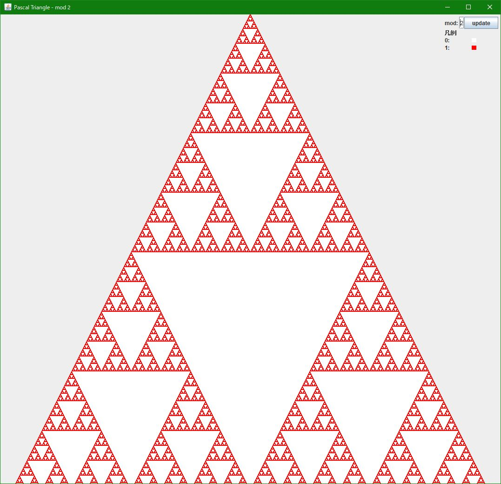
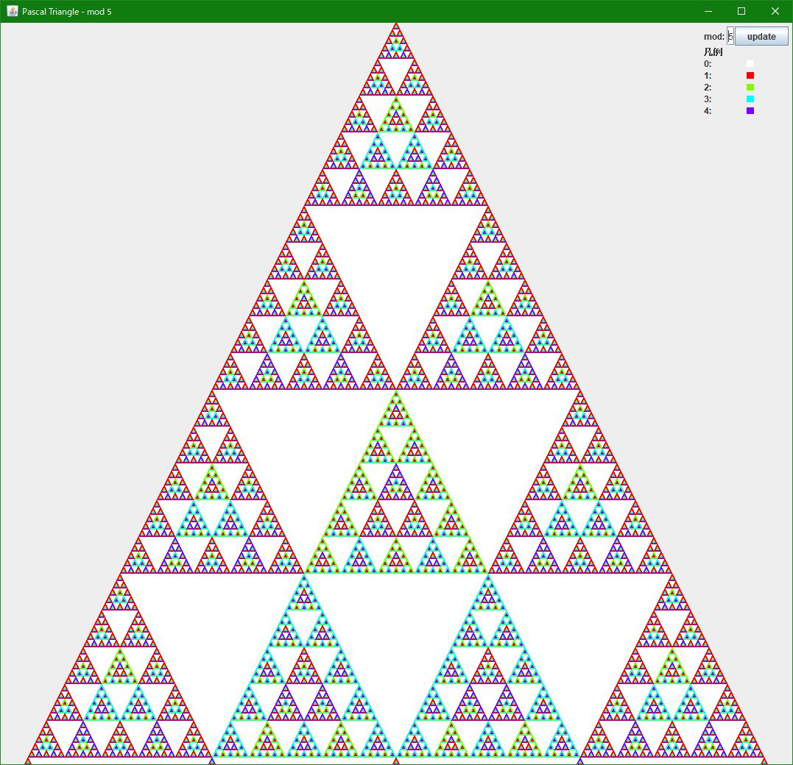
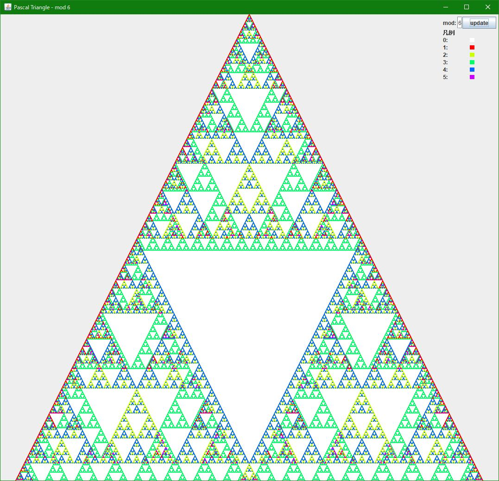

# これは何
パスカルの三角形の、色んな数での剰余を色分けして表現するツール。

作者が高3の頃、数学の授業でパスカルの三角形の2での剰余が題材になり、じゃあ他の数での剰余はどうなんだろうと考えたのがきっかけ。
mod 2〜50まで対応しているが、数が大きいと近い数の色が似通ってしまうので、どっちかといえば鑑賞目的。


# 例

mod 2


mod 5


mod 6

→[スクショフォルダ](screenshot)

# その他
### 色分け
HSBを使って、彩度(S),明度(B)は最大値にして、色相(H)の値を等分して1以上の各値に割り当てている。
例外として、0は常に白で表されている。
ちなみに1は赤(H=0)固定。

```java
// 各値の色一覧
colors = new Color[mod];    // mod は法の値
colors[0] = Color.WHITE;
for (int i=1; i<mod; i++) {
    colors[i] = Color.getHSBColor((float)(i-1)/(mod-1), 1, 1);
}
```


### ちょっとした気づき
素数の場合はどれも似たような形をしていて綺麗。やっぱりフラクタルっぽい。
その他の素因数が一つの数の場合は、素数のときより白い逆三角が細かくなってる。
素因数が複数ある合成数だと、いくつかの三角形がずれて重なってるのが見える。これはこれで面白い。


### 感想
放課後に思いついて、帰宅後さくっと書いただけだけど、とても綺麗なものが描けて面白い。
数学ってたのしいね。